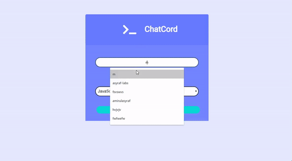

# ChatCord App
Realtime chat app with websockets using Node.js, Express and Socket.io with Vanilla JS on the frontend with a custom UI



## Usage
```
npm install
npm run dev

Go to localhost:3000
```

## Notes
follow along with the tutorial at https://www.youtube.com/watch?v=jD7FnbI76Hg&t=1339s. It is not part of the app
